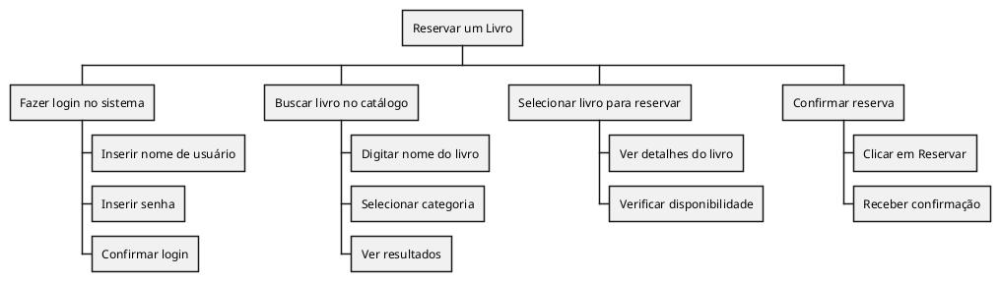

# **Análise Hierárquica de Tarefas (AHT)**

Um Diagrama de **Análise Hierárquica de Tarefas (AHT)** é uma ferramenta usada para decompor uma tarefa complexa em subtarefas mais simples e organizadas de forma hierárquica. Ele ajuda a entender a estrutura de uma tarefa, identificando seus componentes e a relação entre eles. Esse diagrama é muito utilizado no design de interfaces e sistemas interativos, onde é importante mapear as ações que o usuário executará para atingir um objetivo.

Aqui estão os principais elementos de um diagrama de AHT:

1. **Tarefa Principal**: É a tarefa geral que se deseja decompor. Geralmente, está no topo do diagrama.
   
2. **Subtarefas**: São divisões da tarefa principal, que podem ser divididas em ações menores. Cada subtarefa representa uma ação necessária para completar a tarefa.

3. **Relação Hierárquica**: As subtarefas são conectadas à tarefa principal por linhas, mostrando a relação de dependência ou sequência de execução.

4. **Operações**: São as ações específicas ou decisões que o usuário deve tomar durante a execução das subtarefas.

### Exemplo Simplificado de um Diagrama AHT 

#### Sistema de Biblioteca

- **Reservar um Livro (Tarefa Principal)**  
    - **Fazer login no sistema (Subtarefa)**  
        - Inserir nome de usuário  
        - Inserir senha  
        - Confirmar login  
    - **Buscar livro no catálogo (Subtarefa)**  
        - Digitar nome do livro  
        - Selecionar categoria  
        - Ver resultados  
    - **Selecionar livro para reservar (Subtarefa)**  
        - Ver detalhes do livro  
        - Verificar disponibilidade  
    - **Confirmar reserva (Subtarefa)**  
        - Clicar em "Reservar"  
        - Receber confirmação  

Esse diagrama seria útil para identificar as etapas que o usuário segue e também os possíveis pontos onde poderia haver dificuldades ou oportunidades de otimização.

No **PlantUML**, para desenhar um diagrama hierárquico, você pode usar a sintaxe de **WBS (Work Breakdown Structure)** ou organizar os elementos hierarquicamente com setas e indentação. Vou mostrar dois exemplos para representar um diagrama hierárquico:

### Exemplo 1: Usando **WBS** (Work Breakdown Structure)
O WBS é uma estrutura de decomposição hierárquica que pode ser usada para representar um diagrama de Análise Hierárquica de Tarefas (AHT). Aqui está como criar esse tipo de diagrama em PlantUML:

