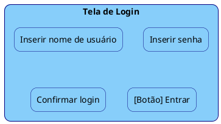
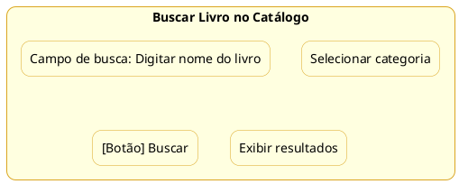
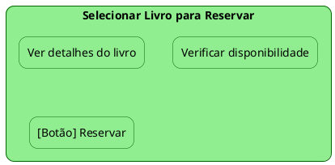
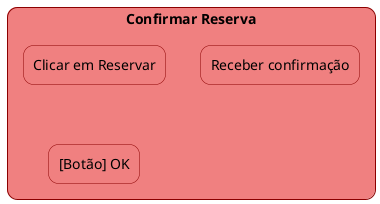

# Protótipo

Para criar protótipos em **PlantUML** a partir de cada tarefa da **Análise Hierárquica de Tarefas (AHT)** para o processo de **reservar um livro**, podemos criar uma interface visual separada para cada subtarefa. Isso vai simular como seria o layout ou a estrutura de uma interface de usuário para cada etapa do processo. Abaixo estão os exemplos de protótipos para cada tarefa.

### 1. **Fazer login no sistema**

### 2. **Buscar livro no catálogo**

### 3. **Selecionar livro para reservar**

### 4. **Confirmar reserva**

### Explicação:
- **Visual de Cada Tarefa**: Cada tarefa foi convertida em um protótipo de interface separada, simulando como seria a tela do sistema para cada ação específica (login, busca, seleção e confirmação).
- **Estilo**: Usei cores diferentes e o `skinparam` para melhorar a visibilidade e estilo dos protótipos.
- **Componentes de UI**: As caixas representam campos de texto, botões e áreas de interação para cada tarefa.

### Como Usar:
- Copie cada bloco de código em seu editor **PlantUML** para gerar os diagramas individualmente.
- Esses protótipos podem ser usados para simular como seria a interface do usuário em cada fase do processo de reserva de livros.

Esses exemplos podem ser expandidos ou ajustados conforme as necessidades do seu projeto!